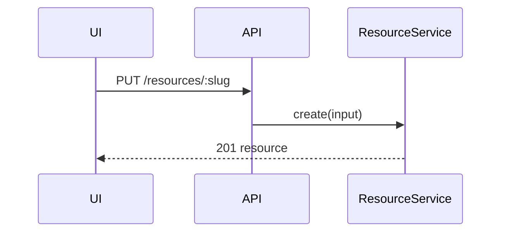

# Blueprint Source Format

The source of truth is one markdown file, `lab/<name>.blueprint.md` — scratch space, not version control. `blueprint-html <source>` renders it to `lab/<name>.html`; the HTML is a disposable view — edit, diff, and argue with the source. Budget: 150–300 lines; if a section fights the budget, cut detail from another section rather than growing the document.

Style rules:

- Sections are `##` headings (the TOC indexes them); subsections are `###`.
- Fences, lists, and tables carry the design. Prose is rationed: one short paragraph where structure can't say it, never several in a row.
- Enumerable criteria (parity semantics, compatibility lists, invariants) are bullet lists, not comma-run sentences — reviewers tick items off.
- State each fact once: scope holds the what, decisions hold the why.
- Sections beyond the six below are allowed, but they go last — after Decisions — and stay short.

## Frontmatter

```yaml
---
title: Resource create flow
tier: medium
description: One-sentence summary shown under the title.
---
```

## Typed fences

The renderer treats these fence languages specially; everything else is ordinary markdown (headings, prose, lists, tables, code blocks).

- `callstack`, `filetree`, `contract`, `signatures` — diff-grammar blocks. Line grammar: first character `+` (added, blue), `-` (removed, orange), `~` (modified, teal), anything else is context; the palette is colorblind-safe and each marker also gets a distinct left-border rail. A trailing ` # comment` renders muted; `file:line` tokens inside comments render as anchor citations. `signatures` bodies are syntax-highlighted as TypeScript.
- `mockup` — raw HTML, inlined into the page in a sandboxed frame. Use for wsff's "mock, don't describe": a rough screen beats three paragraphs.
- `mermaid` — progressive enhancement: renders as a diagram online, stays readable as text offline. Architecture sequence diagrams only.

## Sections

Medium-tier documents fold 2–4 together and omit 5.

### 1. TL;DR

One paragraph: what is being built and why, the tier, and which sections were skipped and why.

### 2. Scope

- **Goal** — the problem in the user's terms, not technical terms.
- **Success signal** — something readable after shipping that says it was worth building: a user outcome, a metric, or "tickets about X stop".
- **Will not touch** — an explicit list of files, systems, and behaviors that stay unchanged. This is mandatory: scope creep is the dominant failure mode of agent-written diffs and is trivially detectable only if the blueprint committed to a boundary.

### 3. System architecture

How services, endpoints, schemas, queues, and stores talk to each other — and nothing below that level.



```contract
PUT /api/resources/:slug
  request:  { destination: string }
  response: { resource: Resource }
```

Data model changes as real DDL in a `sql` fence, new query shapes as SQL comments.

### 4. Program design

The shape of the code below architecture: what an agent would otherwise get wrong. Light pseudocode visualizations, not mermaid.

One `callstack` fence per changed control flow. Every frame is a callable — a function, method, or endpoint; work sequences ("compare X locally", "capture output") belong in the slices table, never in a callstack. Indentation is the call hierarchy; unchanged frames anchor the tree and must exist in the codebase today, cited in a comment:

```callstack
 entrypoint
   runCommand  # src/cli/run.ts:42
+    handleCreateResource
+      ResourceClient.create(input)
+        PUT /resources
+      renderResult
-    legacyCreateFlow  # src/legacy/create.ts:10
```

A `filetree` fence with a one-line purpose comment per file:

```filetree
 src
 └── resource
+    ├── resource-client.ts      # NEW - wraps API contract calls
+    ├── resource-client.test.ts # NEW - covers request/response mapping
~    └── resource-route.ts       # MODIFIED - wires create action into UI
```

A `signatures` fence — sketch-level, deliberately non-compilable. Elide with `// ...`; loose arrow shorthand is fine:

```signatures
interface Cursor {
  position: ItemId
  direction: 'up' | 'down'
  // ...
}

resolveTarget(items: Item[], cursor: Cursor) -> ItemId | null
```

Every symbol on a `-` line or an unchanged line is an anchor — cite it as `file:line` in its comment.

### 5. Vertical slices

Ordered middle-out — start where the change can first be touched, not at the bottom of the stack. Models default to horizontal plans (migrations → services → API → frontend); that default is the thing this section exists to override. Typical shape:

1. API contract serving mock data — verify with curl
2. Frontend against mock data — iterate in browser
3. Wire API to services (services still mocked)
4. Migrations + real persistence
5. Business logic
6. Error handling

Per slice, one markdown table row:

| Slice | Touchable result | Automated verification | Manual verification | ~Size |
|---|---|---|---|---|
| 1 | `curl PUT /api/resources/x` returns mock 201 | `just check` | curl output | ~100 loc |

Automated verification is a runnable command; manual verification is a human observation. Both columns are required.

### 6. Decisions

Resolved decisions with one-line rationale each. No open questions may remain — anything unresolved goes back to the user before the artifact is finalized. Flag any decision that is hard to reverse; those are ADR candidates (see `grill-with-docs`).
